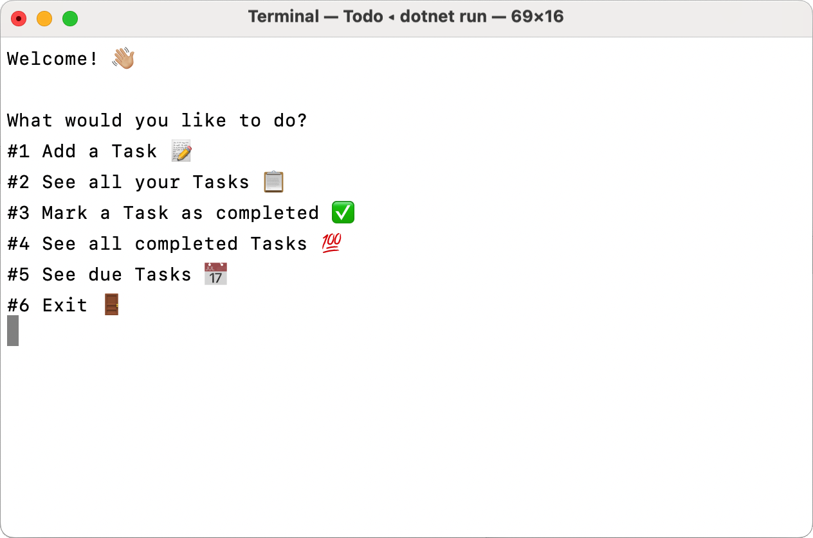

# Todo in C# 

A simple Todo console app in C#. Persists the data in a Json file.

Nothing special, just learning some C#. Here is what the user is presented with:



## How to run:
Go into the project folder and run:
```console
$ dotnet run
```